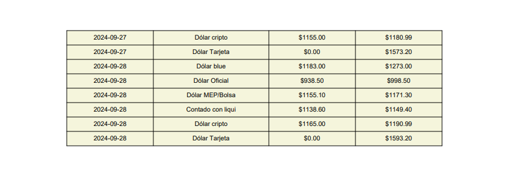
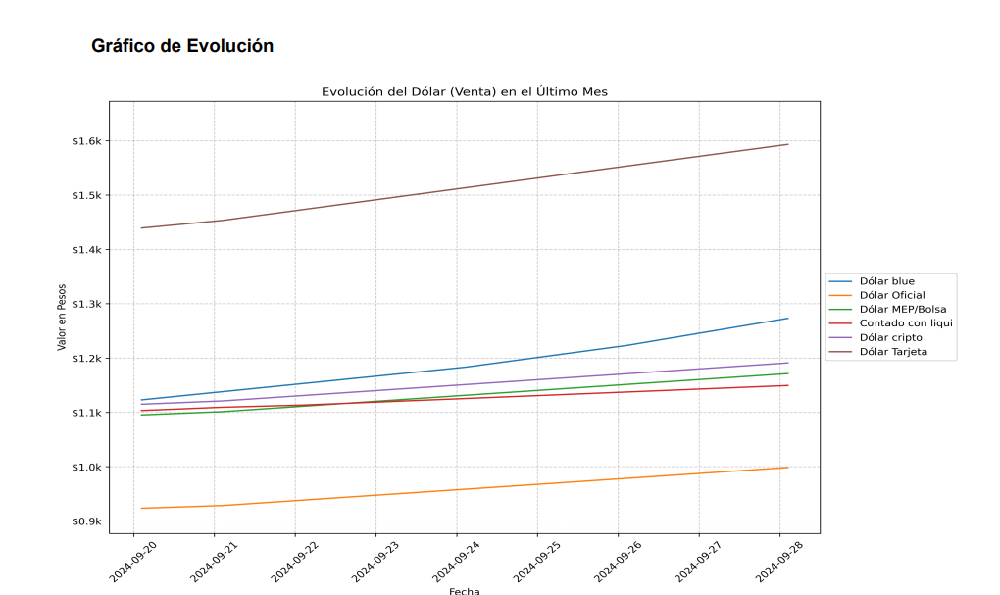

# Dollar-in-Argentina-web-scraping-with-Python

This project is a web scraping tool that collects daily exchange rates of different types of dollars in Argentina (official, Blue, MEP, CCL, crypto, and credit card dollar). The data is extracted from the website [DolarHoy](https://dolarhoy.com/) and stored in a CSV file. At the end of each month, a PDF report is generated with a summary of the dollar values and their evolution.

## Table of Contents
- [Project Overview](#project-overview)
- [Features](#features)
- [Requirements](#requirements)
- [Installation](#installation)
- [Usage](#usage)
  - [Windows Task Scheduler](#windows-task-scheduler)
- [Files](#files)
  - [Python Scripts](#python-scripts)
  - [CSV File](#csv-file)
  - [Batch File](#batch-file)
  - [PDF Report](#pdf-report)
  - [Log File](#log-file)
  - [Report Example](#log-file)


## Project Overview

The project consists of two main scripts:

1. **`dolar_hoy_web_scriping.py`**: This script scrapes the dollar exchange rate data from the [DolarHoy](https://dolarhoy.com/) website and appends it to a CSV file (`datos_dolar.csv`).
   
2. **`generar_informe_mensual.py`**: This script generates a monthly report in PDF format, summarizing the exchange rates for the past month and visualizing the evolution of the different dollar rates.

The project is automated to run daily at 10 AM using the Windows Task Scheduler (`taskschd.msc`) and a batch file (`ejecutar_script.bat`).

## Features

- Scrapes daily dollar exchange rates from [DolarHoy](https://dolarhoy.com/).
- Appends data to the `datos_dolar.csv` file.
- Logs the execution in the `scraper_log.txt` file.
- Generates a monthly PDF report with a table of data and a line chart showing the dollar rate evolution.
- Fully automated using Windows Task Scheduler.

## Requirements

- Python 3.12 or higher
- Required libraries:
  - `requests`
  - `beautifulsoup4`
  - `pandas`
  - `matplotlib`
  - `reportlab`

You can install the required libraries using the following command:

```bash
pip install requests beautifulsoup4 pandas matplotlib reportlab
```
## Installation
1. Clone this repository:
git clone https://github.com/yourusername/Dollar-in-Argentina-web-scraping-with-Python.git

2. Navigate to the project folder:
cd Dollar-in-Argentina-web-scraping-with-Python

3. Ensure you have the necessary Python libraries installed (see Requirements).
4. Set up the Windows Task Scheduler to run the batch file daily at 10 AM (see Usage).

## Usage
Running Manually
You can run the scraping script manually by executing the batch file:
./ejecutar_script.bat

This will scrape the dollar values, append them to the datos_dolar.csv file, and generate the monthly PDF report if it's the end of the month.

Windows Task Scheduler
To automate the execution of the scripts, follow these steps:

1. Open Task Scheduler (taskschd.msc) on your Windows machine.
2. Create a new task and name it "Dollar-in-Argentina-web-scraping".
3. Under the Triggers tab, set the task to run daily at 10:00 AM.
4. Under the Actions tab, choose "Start a program" and point to the ejecutar_script.bat file.
5. Save the task, and it will now run daily at 10 AM.

### Files
#### Python Scripts
**dolar_hoy_web_scriping.py**: This script performs the web scraping from the DolarHoy website and appends the data to the datos_dolar.csv file.
**generar_informe_mensual.py**: This script generates a monthly PDF report, summarizing the dollar data from the past month and plotting a chart of the rates.

#### CSV File
**datos_dolar.csv**: This file stores the daily scraped dollar exchange rates. Each row represents a day's data, and each column represents a specific type of dollar rate (official,Blue, MEP, CCL, crypto, credit card dollar).

#### Batch File
**ejecutar_script.bat**: This batch file is used to run both Python scripts sequentially. It first runs the web scraping script (dolar_hoy_web_scriping.py), followed by the report generation script (generar_informe_mensual.py).

@echo off
cd /d D:\Trabajo\Proyectos\python-webscriping
"C:\Users\Lucia\AppData\Local\Programs\Python\Python312\python.exe" "dolar_hoy_web_scriping.py"
"C:\Users\Lucia\AppData\Local\Programs\Python\Python312\python.exe" "generar_informe_mensual.py"
pause

#### PDF Report
**Monthly PDF Report**: This report is generated at the end of each month by the generar_informe_mensual.py script. It summarizes the dollar values collected during the month and includes visualizations of the data trends.

#### Log File
**scraper_log.txt**: This file logs the execution of the web scraping script, including successful data saving and any errors encountered during the execution.

### Report example (not real data)

